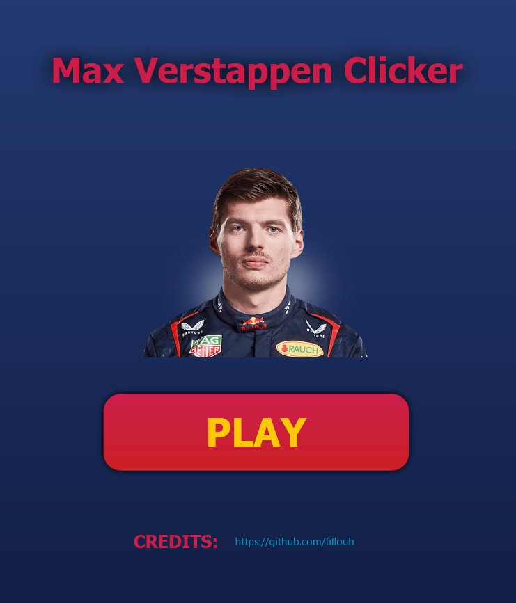

# MAX VERSTAPPEN CLICKER :

  

As a **frustrated Ferrari Fan** and a somewhat **creative programmer**, i've just created this simple Java clicker game based on Max Verstappen to relax myself after being brutally defeated by the latter on Sunday.

* [Game Insights](#game-insights-)
* [Gameplay](#gameplay-)
* [Download](#download-)
* [Credits](#credits-)

## Game Insights:

### Main Menu:

  

### Gameplay:

  
  
<em>Clicca sull'icona per vedere il video</em>

To start clicking infinite Max Vestappen(s) you need to click on play button and to click repeatedly on the left/right mouse button. To quit and reset the game just click the "q" button.

## Download:
To play this game on your device just download the jar file in the ***download section*** 

## Credits:
The main game graphics are made by me

